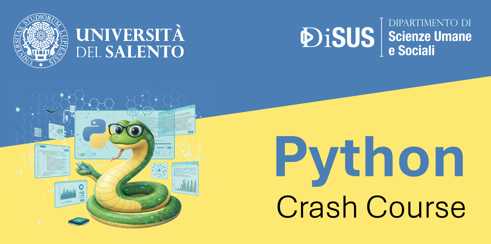

# Python Crash Curse

Questo spazio raccoglie materiali, esempi, esercitazioni e risorse utili per apprendere Python, partendo dalle basi fino ad arrivare all'analisi dei dati e alla visualizzazione grafica.

## Link al grupo Telegram
https://t.me/+d3sdn5JoNwYyMWY8

## Esercitazione Finale

Realizzare un programma in Python per gestire una classe Studente.
Ogni oggetto della classe dovrà rappresentare uno studente con alcune informazioni personali e alcune azioni che può compiere. In Python gli attributi vengono spesso inizializzati nel metodo speciale __init__, che costruisce l’oggetto al momento della creazione.

Obiettivi
La classe Studente deve avere almeno questi attributi:

- nome
- cognome
- eta
- matricola
- voti (una lista di numeri)

La classe deve contenere almeno questi metodi:

- presentati() → stampa o restituisce una breve presentazione dello studente
- aggiungi_voto(voto) → aggiunge un voto alla lista
- calcola_media() → restituisce la media dei voti
- studia(ore) → stampa un messaggio che descrive l’attività dello studente

Consegna: un programma che:

- Definisca la classe Studente.
- Usi il metodo __init__ per inizializzare tutti gli attributi principali.
- Crei almeno due oggetti della classe Studente.
- Chiami i metodi su ciascun oggetto per mostrare che ogni istanza mantiene il proprio stato, cioè i propri attributi e dati.
- Stampi i risultati in modo chiaro.

## Date

- Sabato 7/03 09:00 - 13:00
- Venerdì 13/03 15:00 - 18:00
- Venerdì 20/03 15:00 - 18:00 (Aula B - Edificio Donato Valli, piano terra )
- Sabato 21/03 09:00 - 13:00 (Aula 6 Studium 6)
- ~~Sabato 28/03 09:00 - 13:00 (Aula 6 Studium 6)~~ Annullata
- Venerdì 17/04 09:00 - 13:00 (Aula Seminari Studium 2000)
- Venerdì 24/04 09:00 - 13:00 (Aula Seminari Studium 2000) (Compito finale per rilascio attestati)

## Obiettivi del corso

Il corso è pensato per fornire una preparazione pratica e progressiva su Python, con particolare attenzione a:

- comprensione dei concetti fondamentali del linguaggio
- configurazione corretta degli ambienti di sviluppo
- gestione dei virtual environment
- introduzione alla programmazione orientata agli oggetti
- analisi dei dati con Pandas
- trasformazione dei dati in grafici e visualizzazioni efficaci

## Programma del corso

### 1. Fondamenti di Python
Introduzione ai concetti base del linguaggio:

- sintassi di base
- variabili e tipi di dato
- operatori
- strutture dati principali: liste, tuple, dizionari
- strutture di controllo
- cicli
- funzioni
- moduli e importazioni

### 2. Object-Oriented Programming
Concetti fondamentali della programmazione orientata agli oggetti in Python:

- classi e oggetti
- attributi e metodi
- costruttore `__init__`
- ereditarietà
- esempi pratici di modellazione

### 3. Settaggio degli ambienti di sviluppo e  Virtual environment
Panoramica sugli strumenti necessari per iniziare a sviluppare in Python:

- Inteprete Python
    - installazione di Python
    - configurazione di Visual Studio Code o altri ambienti
    - utilizzo del terminale
    - gestione dei package

- Virtual environment
    - Introduzione all'isolamento degli ambienti di progetto
    - creazione di un ambiente virtuale
    - attivazione e disattivazione
    - utilizzo di `pip`
    - gestione del file `requirements.txt`

### 4. Analisi Dati con Pandas
Introduzione all'analisi e manipolazione dei dati:

- introduzione a Pandas
- Series e DataFrame
- caricamento dati da file CSV ed Excel
- selezione, filtro e trasformazione dei dati
- gestione dei valori mancanti
- raggruppamento e aggregazione

### 5. Dai Dati ai Grafici
Visualizzazione dei dati per l'esplorazione e la comunicazione dei risultati:

- introduzione alla data visualization
- grafici di base
- line plot
- bar chart
- histogram
- scatter plot
- personalizzazione di titoli, assi e legende
- utilizzo di librerie come Matplotlib e Seaborn
